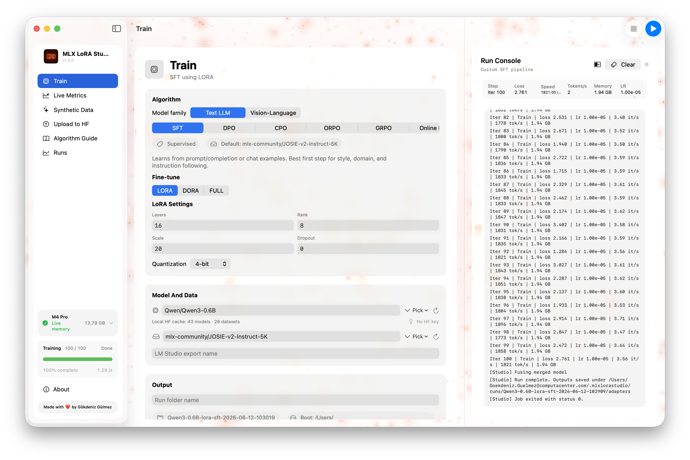
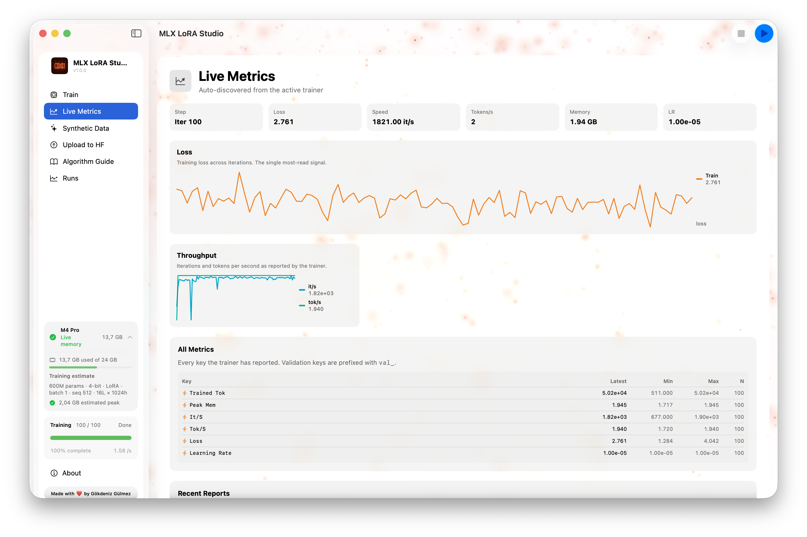
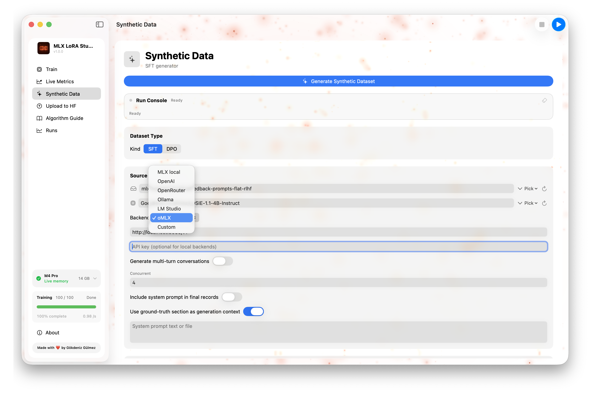
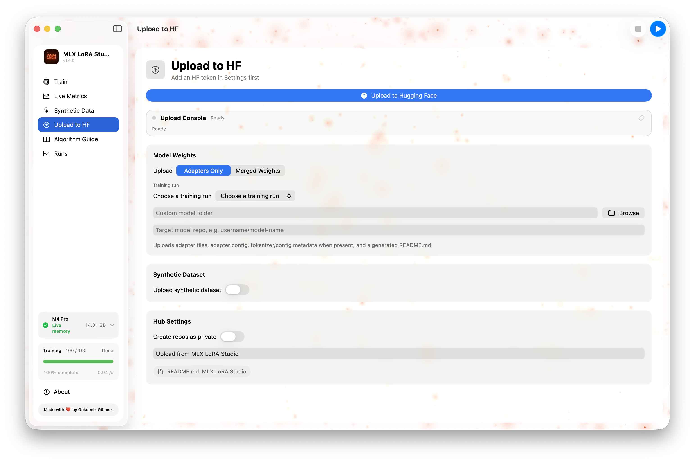
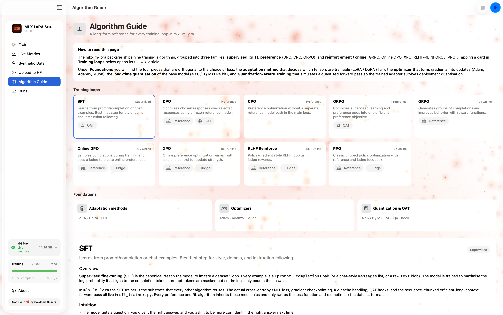
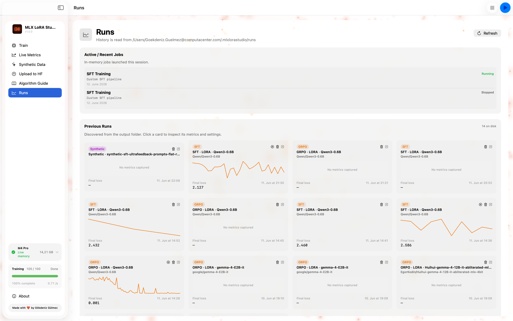

<p align="center">
  
</p>

<p align="center">
  <strong>A native Mac App for LLM fine-tuning on Apple Silicon — fully on-device, fully open source.</strong>
</p>

<p align="center">
  <em>
    There is a quiet kind of power in running a model on the machine that sits in front of you.<br>
    MLX LoRA Studio puts fine-tuning on your Mac — local, native, and visible end to end.<br>
    Pick a model, choose an algorithm, watch the loss fall. The cloud is optional, the code is optional, the mystery is not.
  </em>
</p>

---

## Table of contents

- [Why MLX LoRA Studio?](#why-mlx-lora-studio)
- [What it is](#what-it-is)
- [What it isn't](#what-it-isnt)
- [Features at a glance](#features-at-a-glance)
- [Screenshots](#screenshots)
- [Installation](#installation)
- [Quick start (60 seconds)](#quick-start-60-seconds)
- [A guided tour of the app](#a-guided-tour-of-the-app)
  - [Train](#train)
  - [Live Metrics](#live-metrics)
  - [Synthetic Data](#synthetic-data)
  - [Upload to HF](#upload-to-hf)
  - [Algorithm Guide](#algorithm-guide)
  - [Runs](#runs)
  - [Settings & Onboarding](#settings--onboarding)
- [The training pipeline under the hood](#the-training-pipeline-under-the-hood)
- [Supported training methods](#supported-training-methods)
- [Configuration reference](#configuration-reference)
- [Memory & hardware expectations](#memory--hardware-expectations)
- [Building from source](#building-from-source)
- [Packaging a release (.app + .dmg)](#packaging-a-release-app--dmg)
- [Project layout](#project-layout)
- [Contributing](#contributing)
- [Star History](#star-history)
- [License](#license)
- [Acknowledgments](#acknowledgments)

---

## Why MLX LoRA Studio?

Fine-tuning a large language model used to mean renting a GPU, installing a Python environment
the size of a refrigerator, and babysitting a Jupyter notebook for two days. **MLX LoRA Studio
exists to make that loop feel like using a normal Mac app:**

- **One click to fine-tune.** Pick a model, point it at a dataset, hit *Run*. The app handles
  the Python environment, the dependency install, the adapter paths, the resume logic, the
  metrics, the runs archive, and the export to Hugging Face.
- **Local, on-device, private.** Your prompts, your model, your weights, your disk. No data
  leaves your Mac unless you choose to push it to the Hub at the end.
- **Real algorithms, not toy versions.** SFT, DPO, CPO, ORPO, GRPO, Online DPO, XPO,
  RLHF Reinforce, PPO — with QLoRA, DoRA, full fine-tuning, and **Quantization-Aware Training (QAT)**.
- **Built for everyone.** A beginner can ship a LoRA-tuned Llama model on their M-series Mac
  without writing a line of code. An ML researcher can drop into the YAML config and pin
  every hyperparameter they care about.
- **The trainer is mine, and yours.** MLX LoRA Studio wraps
  [`mlx-lm-lora`](https://github.com/Goekdeniz-Guelmez/mlx-lm-lora) — the same project,
  vendored at `vendor/mlx-lm-lora/`, so what runs in the GUI is exactly what you can run
  from the CLI, and vice versa.

---

## What it is

- A **native macOS app** written in **SwiftUI + AppKit**, distributed as a single `.app` and
  an installable `.dmg`.
- A **graphical front-end** to the [`mlx-lm-lora`](https://github.com/Goekdeniz-Guelmez/mlx-lm-lora)
  Python training pipeline (also developed by the author of this app), with a few
  Swift-side services around it: environment discovery, live memory monitoring, the
  ResourceGuard that keeps the GPU from being driven into swap, run archival, and HF upload.
- A **complete workflow** — train, watch live metrics, generate synthetic data, push the
  resulting adapter to the Hub — without leaving the window.

## What it isn't

- Not a general LLM chat app, IDE, or inference server. (Bring your own for inference;
  Studio produces the adapter you can serve from `mlx-lm` or `ollama`.)
- Not a cross-platform app. **macOS 14+ on Apple Silicon only** — it depends on the
  [MLX](https://github.com/ml-explore/mlx) framework, which is Apple Silicon–only.
- Not a fork of someone else's training code. The trainer is the author's own work, and the
  Studio is a graphical surface for it.

---

## Features at a glance

### 🧠 Training

- **9 training algorithms** out of the box: SFT, DPO, CPO, ORPO, GRPO, Online DPO, XPO,
  RLHF Reinforce, PPO. Pick by use case, not by which one is wired up.
- **LoRA, DoRA, QLoRA (4/6/8-bit), full fine-tuning, and QAT** (Quantization-Aware Training
  for SFT/DPO/ORPO) — the same training surface as the underlying `mlx-lm-lora` CLI.
- **Adapter resume** — point a new run at an existing adapter checkpoint and Studio picks
  up where the last run left off.
- **Judge / reward model selection** for RL-style algorithms (GRPO, XPO, Online DPO, PPO,
  RLHF Reinforce): pick a base model + a judge model from the Hugging Face cache.
- **YAML-driven configuration** — the GUI's form is a *view* over a YAML config; the
  same config can be exported and rerun on the CLI.

### 📊 Live observability

- **Live metrics panel** with loss, learning rate, gradient norm, throughput, and a
  refreshable plot of recent steps.
- **Live memory monitor** in the sidebar: current wired + active memory, plus a static
  estimate of what the *current configuration* should cost.
- **Run progress bar** in the sidebar while a job is in flight.
- **Pause / resume / stop** from the toolbar without losing the run.

### 🧪 Synthetic data

- **Prompt generation** from a base model — describe the distribution you want and let
  the model propose prompts.
- **SFT pair generation** with a teacher model — synthetic prompt/completion pairs.
- **DPO preference generation** with a base + judge model — synthetic chosen / rejected
  pairs.
- **Preview & export** — browse the generated dataset in the app, then export to JSONL
  for any of the training tabs.

### 🚀 Publish

- **One-click Hugging Face upload** of adapters (LoRA / DoRA / QLoRA / QAT) with
  metadata, model card, and license pickers.
- **Runs archive** — every run's config, logs, and final adapter weights are kept in
  `~/Library/Application Support/MLXLoRAStudio/runs/` and surfaced in the *Runs* tab
  for re-run, resume, or upload.

### 🛠 Engineering

- **Python environment discovery & provisioning** — Studio finds an existing venv/conda
  env that has the trainer installed, or provisions one for you. No "I forgot to install
  the deps" loop.
- **ResourceGuard** — watches the OS memory pressure signals and refuses to start a
  job the system can't fit, with a clear human-readable reason.
- **Release pipeline** — `script/build_and_run.sh` builds a redistributable `.app` and
  `.dmg` from a single `version` file. The bundled Python + `mlx-lm-lora` checkout is
  copied into the app, so a drag-installed copy works without the source tree.
- **CI release** — push a `v*` tag, GitHub Actions produces a draft release with the
  signed `.dmg` attached (see `.github/workflows/release.yml`).

---

## Installation

### Option 1 — Download a release (recommended for users)

1. Go to the [Releases](../../releases) page.
2. Download the latest `MLX-LoRA-Studio-X.Y.Z.dmg`.
3. Open the DMG, drag **MLX LoRA Studio** to **/Applications**.
4. Launch it from `/Applications` (or `Spotlight`).
5. On first launch, allow the bundled Python helper to be opened in **System Settings →
   Privacy & Security** (Gatekeeper).

<p style="color: red;"><strong>If macOS says the app is damaged or cannot be opened, run this command once:</strong></p>

```bash
sudo xattr -dr com.apple.quarantine "/Applications/MLX LoRA Studio.app"
```

The first time you start a run, Studio will **discover or provision** a Python environment
with the right dependencies — no terminal needed.

### Option 2 — Build it yourself

See [Building from source](#building-from-source) below.

### System requirements

| Component | Requirement                                                          |
|-----------|----------------------------------------------------------------------|
| OS        | **macOS 14 (Sonoma) or later**                                       |
| Chip      | **Apple Silicon** (M1 / M2 / M3 / M4 family). Intel is not supported. |
| RAM       | **16 GB minimum**; 24 GB+ recommended for ≥13B models               |
| Disk      | ~5 GB for the app + a per-model HF cache (varies by model)           |
| Python    | Bundled Python is used; a system Python is **not** required          |

---

## Quick start (60 seconds)

1. **Launch MLX LoRA Studio.**
2. On the **Train** tab:
   - Pick a **base model** (any MLX-compatible model you've already pulled into your
     HF cache, e.g. `mlx-community/Meta-Llama-3-8B-Instruct-4bit`).
   - Pick a **dataset** (e.g. `mlx-community/JOSIE-v2-Instruct-5K`).
   - Leave the algorithm at **SFT** for a first run.
   - Hit **Run** in the toolbar.
3. The **sidebar memory card** updates in real time; the **Live Metrics** tab shows
   loss / learning rate as the run progresses. Pause, resume, or stop from the toolbar.
4. When the run finishes, head to the **Runs** tab → open the run → **Upload to HF**
   to publish the adapter.

> **Tip:** the **Algorithm Guide** tab in the sidebar explains *why* you'd pick DPO
> over SFT, when GRPO makes sense, and how QAT differs from QLoRA — it pairs with the
> **Train** tab rather than replacing it.

---

## A guided tour of the app

The app is organised around a left-hand sidebar with seven sections. Each one maps to a
single screen in the detail pane.

### Train

<p align="center">
  
</p>

The heart of the app. The form is grouped into:

1. **Model & data** — base model, dataset, chat template, max sequence length, packing.
2. **Adapter shape** — LoRA rank, alpha, dropout, target modules; or switch to DoRA /
   QLoRA / full fine-tune; or enable QAT with a target bit width.
3. **Optimization** — learning rate, schedule, warmup, weight decay, grad accumulation,
   max steps / epochs.
4. **Algorithm-specific** — only the fields the selected algorithm actually uses.
   For SFT: completion-only loss. For DPO/CPO/ORPO: beta, label smoothing. For GRPO/PPO:
   judge model, reward shaping, group size, KL coefficient.
5. **Resume / output** — where to write the adapter, whether to resume from an existing
   checkpoint, and how often to save.

A **memory estimate** at the bottom of the form shows what the current configuration
*should* cost, so you can change a knob and immediately see the projected effect.

### Live Metrics

<p align="center">
  
</p>

A second-by-second view of what the runner is doing:

- Loss / reward / KL over the last N steps, with a refreshable line plot.
- Throughput (tokens/sec) and elapsed time.
- A scrolling console of the last lines of stdout/stderr from the Python job, for when
  something looks off and you want to read the underlying trace.

### Synthetic Data

<p align="center">
  
</p>

Three sub-modes, all driven by local models:

- **Prompts** — base model proposes prompts matching a topic + distribution.
- **SFT** — teacher model writes (prompt, completion) pairs.
- **DPO** — base + judge produce (prompt, chosen, rejected) triples.

Outputs are written as JSONL, previewed in-app, and ready to feed straight back into
the **Train** tab.

### Upload to HF

<p align="center">
  
</p>

A guided form for pushing a finished adapter to the Hugging Face Hub:

- Repository name, visibility (public / private), license.
- Model card fields: base model, language, tags, dataset card, intended use.
- Token source: env var, keychain entry, or paste.
- One **Push** button. The app shows a step-by-step progress feed and a final URL.

### Algorithm Guide

<p align="center">
  
</p>

A built-in reference for the 9 supported algorithms. Each entry covers:

- **What it is** in one paragraph, with the math in plain words.
- **When to use it** — the practical "SFT first, then DPO" ladder.
- **Key hyperparameters** and how to think about them.
- **Failure modes** — what goes wrong if beta is too high, group size is too small, etc.

This is the screen to open when a user is choosing between, say, ORPO and CPO, and
isn't sure which one applies to their data.

### Runs

<p align="center">
  
</p>

A table of every run Studio has ever done, sorted by recency:

- Status (running / paused / done / failed / cancelled).
- Algorithm, base model, dataset, last loss, duration.
- The run's full YAML config and final adapter path.
- Actions: **Open** (loads it back into the form), **Resume** (start a new run from
  the same adapter), **Upload to HF**, **Reveal in Finder**, **Delete**.

### Settings & Onboarding

- **Settings** controls the Python environment Studio should use (auto-discovered,
  pinned to a specific venv, or freshly provisioned), HF cache paths, default
  templates, and the optional animated background.
- **Onboarding** is a 5-step tour shown on first launch: it walks through picking
  a model, picking a dataset, choosing an algorithm, starting a run, and finding
  the metrics. It can be re-opened from the **About** tab.

---

## The training pipeline under the hood

```
┌─────────────────────────────────────────────────────────────────────┐
│  SwiftUI app  (Sources/MLXLoRAStudio)                               │
│  ┌──────────────┐   ┌─────────────────┐   ┌──────────────────────┐ │
│  │ AppStore     │──▶│ PythonJobRunner │──▶│ LiveMemoryMonitor    │ │
│  │ (state)      │   │ (subprocess +   │   │ + ResourceGuard      │ │
│  └──────────────┘   │  line streaming)│   └──────────────────────┘ │
│                     └────────┬────────┘                             │
│                              │ stdin/stdout                         │
└──────────────────────────────┼──────────────────────────────────────┘
                               │
                               ▼
┌─────────────────────────────────────────────────────────────────────┐
│  Python helper  (Backend/training_runner.py)                        │
│  • Translates the YAML config into mlx-lm-lora CLI flags            │
│  • Streams metrics on stdout as JSON lines                          │
│  • Saves adapter checkpoints under the run dir                      │
└──────────────────────────────┬──────────────────────────────────────┘
                               │
                               ▼
┌─────────────────────────────────────────────────────────────────────┐
│  mlx-lm-lora  (vendor/mlx-lm-lora — same code the CLI uses)         │
│  • SFT / DPO / CPO / ORPO / GRPO / Online DPO / XPO /               │
│    RLHF Reinforce / PPO                                             │
│  • LoRA / DoRA / QLoRA / full / QAT                                 │
│  • MLX-native training, fused-metal on Apple Silicon                │
└─────────────────────────────────────────────────────────────────────┘
```

The app and the trainer communicate over a simple line-delimited JSON protocol: the
runner emits one JSON object per training step (loss, lr, grad_norm, tokens/sec, etc.),
plus structured `event` lines for phase changes (`starting`, `epoch`, `checkpoint`,
`done`, `error`). This keeps the Swift side reactive without polling.

---

## Supported training methods

Mirrored from the underlying `mlx-lm-lora` trainer:

| Family   | Algorithms                                                                                  |
|----------|---------------------------------------------------------------------------------------------|
| Supervised fine-tuning | SFT                                                                                |
| Preference             | DPO, CPO, ORPO                                                                      |
| RL / online            | GRPO, Online DPO, XPO, RLHF Reinforce, PPO                                           |

| Adapter type                  | Notes                                                          |
|-------------------------------|----------------------------------------------------------------|
| **LoRA**                      | Low-rank adapters, configurable rank / alpha / target modules  |
| **DoRA**                      | Weight-decomposed LoRA                                        |
| **QLoRA (4/6/8-bit)**          | Quantized base model + LoRA adapters                           |
| **Full fine-tuning**          | Train all parameters                                           |
| **QAT** (Quantization-Aware)  | SFT / DPO / ORPO; project quantization during training         |

All combinations are exposed in the **Train** tab's adapter section.

---

## Configuration reference

The GUI's form maps 1:1 to a YAML file (also the format the underlying `mlx-lm-lora` CLI
takes). You can find every run's config in `~/Library/Application Support/MLXLoRAStudio/runs/`.

A minimal SFT example:

```yaml
# This file was generated by MLX LoRA Studio and is safe to edit by hand.
# The same file can be passed to `mlx_lm_lora` on the CLI.

train_mode: sft
model: mlx-community/Meta-Llama-3-8B-Instruct-4bit
dataset:
  - mlx-community/JOSIE-v2-Instruct-5K
adapter:
  type: lora
  rank: 16
  alpha: 32
  dropout: 0.05
  target_modules: [q_proj, k_proj, v_proj, o_proj]
optim:
  learning_rate: 2.0e-4
  schedule: cosine
  warmup_steps: 20
  weight_decay: 0.0
  grad_accumulation_steps: 8
train:
  max_steps: 1000
  batch_size: 2
  max_seq_len: 2048
  save_every: 200
output:
  adapter_path: ~/Library/Application Support/MLXLoRAStudio/runs/<id>/adapter
```

> Run a YAML directly from the terminal (no GUI):
>
> ```bash
> python -m mlx_lm_lora -c my_run.yaml
> ```

---

## Memory & hardware expectations

Approximate, single-GPU Apple Silicon, batch_size 2, 2048-token sequences:

| Base model size | LoRA r=16 | QLoRA 4-bit | Full FT |
|-----------------|-----------|-------------|---------|
| 1B–3B           | 8 GB      | 5 GB        | 12 GB   |
| 7B–8B           | 14 GB     | 7 GB        | 32 GB   |
| 13B             | 22 GB     | 10 GB       | 56 GB   |
| 70B             | 110 GB    | 38 GB       | —       |

The **live memory card** in the sidebar shows the OS's reported wired + active memory;
the **memory estimate** below the form shows what the current configuration should
cost, given the base model size, the sequence length, the adapter shape, and the
quantization mode. **ResourceGuard** refuses to start a run whose estimated cost
would push the system into swap.

---

## Building from source

Requires the Xcode command-line tools (Swift 5.9+, macOS 14+ SDK):

```bash
git clone https://github.com/Goekdeniz-Guelmez/MLX-LoRA-Studio.git
cd mlx-lm-lora-app

# Build + run the app:
./script/build_and_run.sh

# Build a release .dmg:
./script/build_and_run.sh --package

# Open the .app in lldb:
./script/build_and_run.sh --debug

# Tail the unified log while the app runs:
./script/build_and_run.sh --logs
```

The build script:

1. Compiles all Swift files in `Sources/MLXLoRAStudio/` with `swiftc` against
   `SwiftUI` and `AppKit`.
2. Bundles the app icon, the Python helper (`Backend/`), and the vendored
   `mlx-lm-lora` checkout (`vendor/`) into `Contents/Resources/`.
3. Stamps the version from the `version` file at the repo root into
   `Info.plist`.

The output `.app` is fully self-contained — you can copy it to another Mac and
it will still run, as long as that Mac has Python access (or you let Studio
provision one).

---

## Packaging a release (.app + .dmg)

The release pipeline is fully automated. To cut a release:

```bash
# 1. Bump the version file
echo "1.1.0" > version

# 2. Commit + tag
git add version
git commit -m "Bump version to 1.1.0"
git tag v1.1.0
git push origin main --follow-tags
```

Pushing a `v*` tag triggers `.github/workflows/release.yml`:

1. The build runs on a `macos-14` runner.
2. It produces `dist/MLX-LoRA-Studio-<version>.dmg` and the matching `.app`.
3. A **draft** GitHub Release is created with the DMG attached.

Edit the draft's release notes in the GitHub UI, then publish.

You can also run the pipeline locally:

```bash
./script/build_and_run.sh --package
# → dist/MLX-LoRA-Studio-1.1.0.dmg
```

---

## Project layout

```
.
├── Sources/
│   ├── Media/                       # logo.png, logo_ultra-wide.png
│   └── MLXLoRAStudio/
│       ├── App/                     # App entry point (SwiftUI @main)
│       ├── Models/                  # TrainingModels, PythonEnvironment
│       ├── Services/                # PythonJobRunner, HFCacheScanner, …
│       ├── Stores/                  # AppStore (Observable state root)
│       ├── Support/                 # LiveMemoryMonitor, MemoryEstimator
│       └── Views/                   # All SwiftUI screens
├── Backend/                         # Python helpers invoked by the Swift side
│   ├── training_runner.py
│   └── hf_upload.py
├── vendor/
│   └── mlx-lm-lora/                 # The training library the GUI wraps
├── script/
│   └── build_and_run.sh             # Builds .app + .dmg
├── Tests/
├── .github/workflows/release.yml    # Tag-driven release pipeline
├── Package.swift                    # SwiftPM manifest
├── version                          # Single source of truth for the app version
└── README.md
```

---

## Contributing

Bug reports, feature requests, and PRs are very welcome.

- **Bugs / UX issues** → open an issue with the macOS version, chip, and a small log
  excerpt from `Console.app` filtered on the `MLXLoRAStudio` subsystem.
- **Algorithm / trainer changes** → open the issue in
  [`mlx-lm-lora`](https://github.com/Goekdeniz-Guelmez/mlx-lm-lora) first; the trainer
  is the source of truth, and the GUI follows it.
- **GUI-only changes** → fork, branch, run `./script/build_and_run.sh --verify` to
  smoke-test the bundle, and open a PR.

For larger changes, please open an issue first to align on direction.

---

## Star History

<a href="https://star-history.com/#Goekdeniz-Guelmez/MLX-LoRA-Studio&Date">
  <picture>
    <source media="(prefers-color-scheme: dark)" srcset="https://api.star-history.com/svg?repos=Goekdeniz-Guelmez/MLX-LoRA-Studio&type=Date&theme=dark" />
    <source media="(prefers-color-scheme: light)" srcset="https://api.star-history.com/svg?repos=Goekdeniz-Guelmez/MLX-LoRA-Studio&type=Date" />
    
  </picture>
</a>

---

## License

MIT — see `LICENSE` for the full text. The vendored
[`mlx-lm-lora`](vendor/mlx-lm-lora/) and the Python helpers in `Backend/` are MIT
under the same project.

---

## Acknowledgments

- [Apple MLX](https://github.com/ml-explore/mlx) — the array framework that makes
  on-device training actually pleasant on Apple Silicon.
- [mlx-lm](https://github.com/ml-explore/mlx-lm) — the model + tokenizer plumbing
  that `mlx-lm-lora` builds on.
- [Hugging Face](https://huggingface.co) — model + dataset hub; the entire
  community-trained ecosystem this app is a window into.
